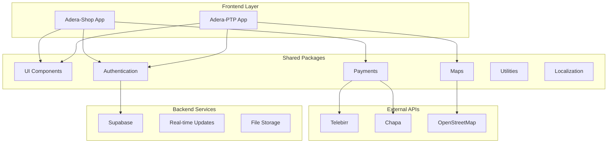
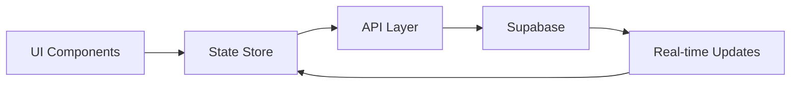

# System Patterns & Architecture - Adera Hybrid App

**Last Updated**: 2025-01-09  
**Architecture Version**: 1.0  
**Pattern Status**: Established Foundation

## System Architecture

### High-Level Architecture


### Monorepo Structure Pattern
```
/
├── apps/                    # Application entry points
│   ├── adera-ptp/          # Logistics app (Expo)
│   └── adera-shop/         # E-commerce app (Expo)
├── packages/               # Shared libraries
│   ├── ui/                 # Design system components
│   ├── auth/               # Authentication logic
│   ├── payments/           # Payment gateway integrations
│   ├── maps/               # Location services
│   ├── utils/              # Common utilities
│   └── localization/       # i18n support
└── .adera/                 # Project metadata
    ├── memory/             # Memory bank
    └── changelogs/         # Release notes
```

## Design Patterns

### Component Architecture
- **Atomic Design**: Components organized as atoms → molecules → organisms
- **Theme Provider Pattern**: Centralized theming with context
- **Compound Components**: Complex UI elements with sub-components
- **Render Props**: Flexible component composition

### State Management Pattern
```javascript
// Planned: Zustand store pattern
const useAuthStore = create((set, get) => ({
  user: null,
  role: null,
  login: async (credentials) => {
    // Authentication logic
  },
  logout: () => set({ user: null, role: null }),
}));
```

### Data Flow Architecture


## Key Technical Decisions

### Framework Choices
- **React Native**: Cross-platform with Expo managed workflow
- **Expo SDK 54**: Latest stable for production deployment
- **Supabase**: PostgreSQL + real-time + auth + storage
- **Turborepo**: Monorepo orchestration with caching

### Authentication Architecture
```javascript
// Supabase Auth + RLS Pattern
const AuthContext = createContext();

const AuthProvider = ({ children }) => {
  const [session, setSession] = useState(null);
  
  useEffect(() => {
    supabase.auth.getSession().then(({ data: { session } }) => {
      setSession(session);
    });
    
    const { data: { subscription } } = supabase.auth.onAuthStateChange(
      (event, session) => setSession(session)
    );
    
    return () => subscription.unsubscribe();
  }, []);
  
  return (
    <AuthContext.Provider value={{ session, user: session?.user }}>
      {children}
    </AuthContext.Provider>
  );
};
```

### Role-Based Access Control
```typescript
enum UserRole {
  CUSTOMER = 'customer',
  PARTNER = 'partner', 
  DRIVER = 'driver',
  STAFF = 'staff',
  ADMIN = 'admin'
}

const RoleGuard = ({ allowedRoles, children }) => {
  const { user } = useAuth();
  const userRole = user?.user_metadata?.role;
  
  if (!allowedRoles.includes(userRole)) {
    return <UnauthorizedScreen />;
  }
  
  return children;
};
```

## Component Patterns

### Theme System Pattern
```javascript
// Ethiopian-inspired design tokens
const theme = {
  colors: {
    primary: '#2E7D32',      // Ethiopian green
    secondary: '#FFD700',    // Ethiopian gold
    accent: '#D32F2F',       // Ethiopian red
  },
  spacing: {
    xs: 4, sm: 8, md: 16, lg: 24, xl: 32
  },
  typography: {
    heading: { fontSize: 24, fontWeight: 'bold' },
    body: { fontSize: 16, lineHeight: 24 }
  }
};
```

### Form Handling Pattern
```javascript
// Planned: React Hook Form + Zod validation
const ParcelCreationForm = () => {
  const { control, handleSubmit, formState: { errors } } = useForm({
    resolver: zodResolver(parcelSchema)
  });
  
  const onSubmit = (data) => {
    // Create parcel with validated data
  };
  
  return (
    <Form onSubmit={handleSubmit(onSubmit)}>
      <Controller
        name="recipientPhone"
        control={control}
        render={({ field }) => (
          <TextInput
            {...field}
            label="Recipient Phone"
            error={errors.recipientPhone?.message}
          />
        )}
      />
    </Form>
  );
};
```

## Data Patterns

### Database Schema Pattern
```sql
-- User management with RLS
CREATE TABLE users (
  id UUID PRIMARY KEY DEFAULT gen_random_uuid(),
  email TEXT UNIQUE NOT NULL,
  role user_role NOT NULL DEFAULT 'customer',
  profile JSONB,
  created_at TIMESTAMP WITH TIME ZONE DEFAULT NOW()
);

-- Parcel tracking with event log
CREATE TABLE parcels (
  id UUID PRIMARY KEY DEFAULT gen_random_uuid(),
  tracking_id TEXT UNIQUE NOT NULL,
  sender_id UUID REFERENCES users(id),
  recipient_phone TEXT NOT NULL,
  status INTEGER DEFAULT 0,
  created_at TIMESTAMP WITH TIME ZONE DEFAULT NOW()
);

CREATE TABLE parcel_events (
  id UUID PRIMARY KEY DEFAULT gen_random_uuid(),
  parcel_id UUID REFERENCES parcels(id),
  status INTEGER NOT NULL,
  actor_id UUID REFERENCES users(id),
  location POINT,
  timestamp TIMESTAMP WITH TIME ZONE DEFAULT NOW()
);
```

### QR Code Security Pattern
```javascript
// HMAC-SHA256 based QR generation
const generateQRCode = (trackingId, phase, pickupPartnerId, issuedAt) => {
  const payload = `${trackingId}|${phase}|${pickupPartnerId}|${issuedAt}`;
  const hash = crypto
    .createHmac('sha256', process.env.QR_SECRET)
    .update(payload)
    .digest('hex')
    .substring(0, 8); // 8-char base36
    
  return `${trackingId}-${phase}-${issuedAt}-${hash}`;
};
```

## Communication Patterns

### Real-time Updates
```javascript
// Supabase real-time channels
const useParcelTracking = (trackingId) => {
  const [parcel, setParcel] = useState(null);
  
  useEffect(() => {
    const channel = supabase
      .channel(`parcel:${trackingId}`)
      .on('postgres_changes', 
        { event: '*', schema: 'public', table: 'parcel_events' },
        (payload) => {
          // Update parcel status in real-time
          setParcel(prev => ({ ...prev, ...payload.new }));
        }
      )
      .subscribe();
      
    return () => supabase.removeChannel(channel);
  }, [trackingId]);
  
  return parcel;
};
```

### Error Handling Pattern
```javascript
// Centralized error handling
const useErrorHandler = () => {
  const showError = (error) => {
    if (error.code === 'NETWORK_ERROR') {
      // Show offline message
    } else if (error.code === 'AUTH_ERROR') {
      // Redirect to login
    } else {
      // Show generic error
    }
  };
  
  return { showError };
};
```

## Performance Patterns

### Offline-First Pattern
```javascript
// Service worker for critical operations
const useOfflineQueue = () => {
  const [queue, setQueue] = useState([]);
  
  const addToQueue = (operation) => {
    setQueue(prev => [...prev, operation]);
    // Store in AsyncStorage for persistence
  };
  
  const processQueue = async () => {
    // Process queued operations when online
  };
  
  return { addToQueue, processQueue };
};
```

### Bundle Optimization
- **Code Splitting**: Dynamic imports for large features
- **Tree Shaking**: Remove unused dependencies
- **Image Optimization**: WebP with fallbacks
- **Lazy Loading**: Load components on demand

## Testing Patterns

### Component Testing
```javascript
// Jest + Testing Library pattern
describe('Button Component', () => {
  it('renders with Ethiopian theme colors', () => {
    render(
      <ThemeProvider>
        <Button variant="primary">Test</Button>
      </ThemeProvider>
    );
    
    expect(screen.getByRole('button')).toHaveStyle({
      backgroundColor: '#2E7D32'
    });
  });
});
```

### E2E Testing Pattern
```javascript
// Detox pattern for cross-platform testing
describe('Parcel Creation Flow', () => {
  it('should create parcel successfully', async () => {
    await element(by.id('create-parcel-btn')).tap();
    await element(by.id('recipient-phone')).typeText('+251911234567');
    await element(by.id('submit-btn')).tap();
    await expect(element(by.text('Parcel created successfully'))).toBeVisible();
  });
});
```

## Security Patterns

### Input Validation
```javascript
// Zod schema validation
const parcelSchema = z.object({
  recipientPhone: z.string()
    .regex(/^\+251[0-9]{9}$/, 'Invalid Ethiopian phone number'),
  weight: z.number().min(0.1).max(50),
  pickupLocation: z.object({
    lat: z.number(),
    lng: z.number()
  })
});
```

### API Security
- **Row Level Security**: Supabase RLS policies
- **Input Sanitization**: All user inputs validated
- **Rate Limiting**: API calls throttled
- **Secure Storage**: Sensitive data encrypted
